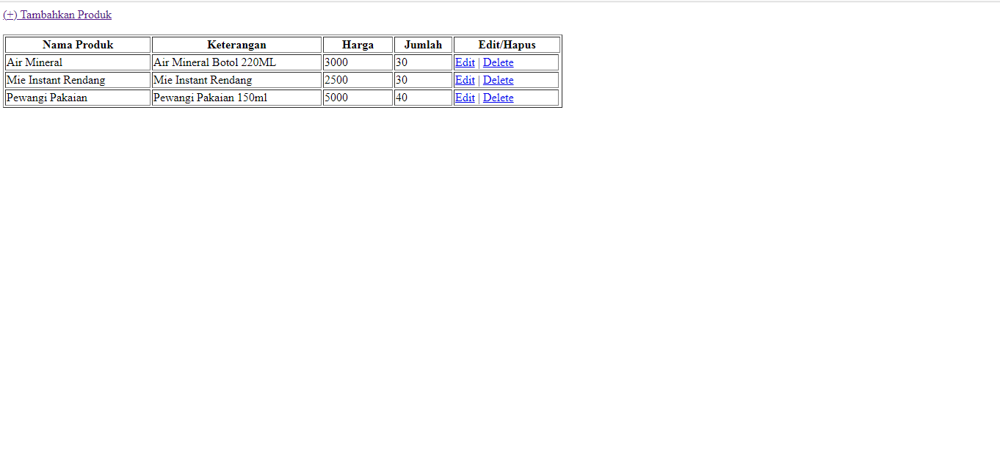

Argian Guca Prawira's submission for Arkademy Bootcamp pre-test.
 A simple CRUD created by using HTML, CSS, PHP and mySQL.
 Create an 'arkademy' database, and then import the produk.sql file into the database.
Access the repository through https://github.com/argianguca/guca-arkademy 

Thank you.
